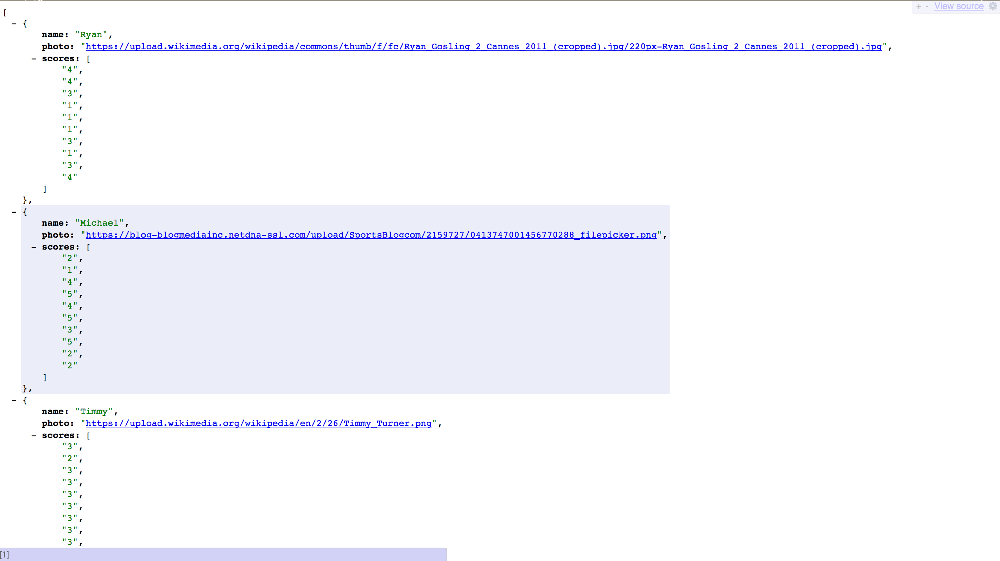
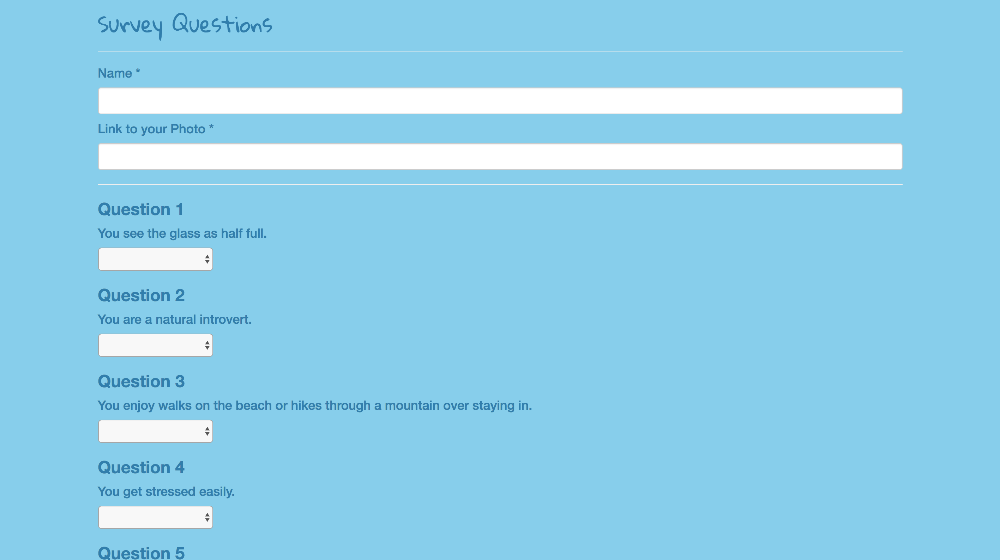

# Friend Finder

[Friend Finder app link](https://ancient-bastion-34473.herokuapp.com/
)

### Making friends as an adult is not nearly as easy as it was when we were growing up. Friend Finder is an app that uses survey questions to match you up with a new friend based on compatibility. 

## Instructions
### Simply fill out the survey questions and you will be matched with a new friend that you are most compatible with.

## Technologies
* [HTML](https://developer.mozilla.org/en-US/docs/Web/HTML) - hypertext markup language
* [CSS](https://developer.mozilla.org/en-US/docs/Web/CSS) - cascading style sheets
* [Bootstrap](http://getbootstrap.com/) - front-end framework
* [Javascript](https://developer.mozilla.org/en-US/docs/Web/JavaScript) - lightweight, interpreted, programming language with first-class functions
* [jQuery](https://jquery.com/) - fast, small, and feature-rich JavaScript library
* [Node.js](https://nodejs.org/en/) - evented I/O for the backend
* [Express](http://expressjs.com/) - fast node.js network app framework

## Installation

Download the zip or fork the repository.
NPM install the dependencies in the directory.
Run node server.js in the command line.
Open up localhost:3000 in your browser.

## Screenshots
### This is the landing page.

### This is the list of friends and their survey question answers in the system.

### These are some of the survey questions.

### This is an example of a result that the user gets.
